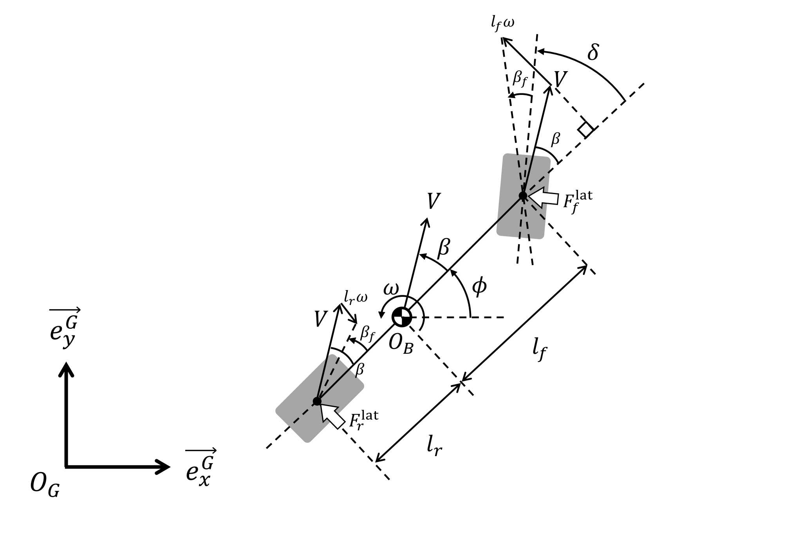
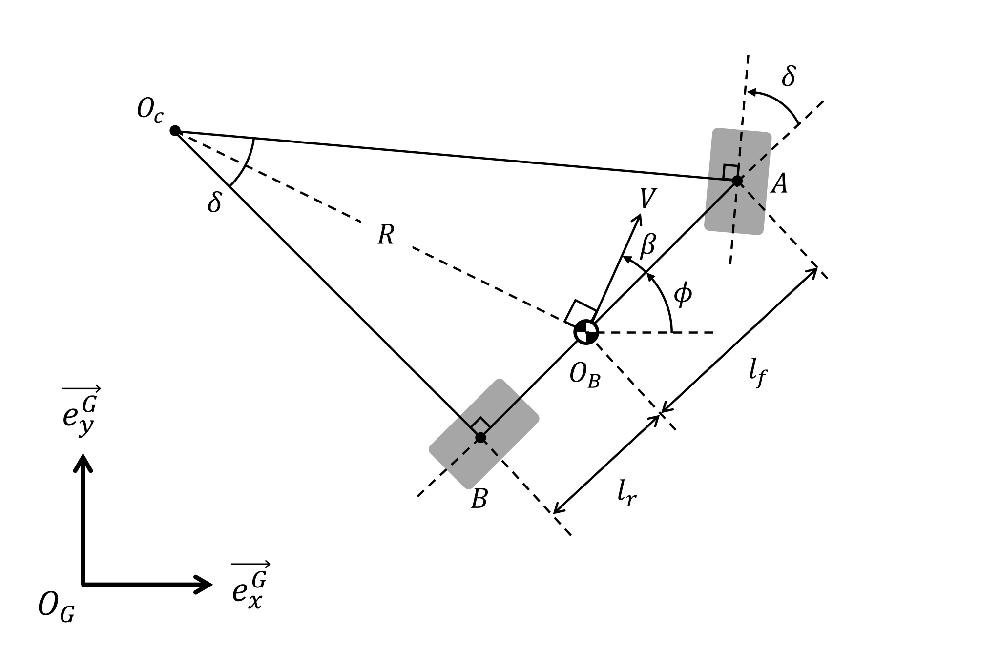
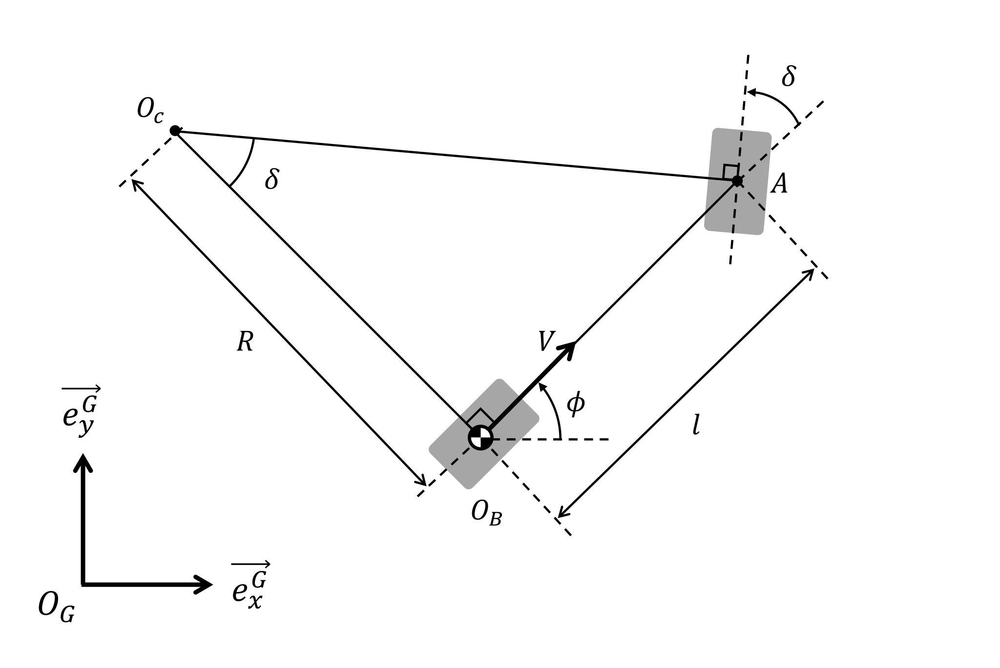

# Path Tracking
Several path-tracking algorithms are (going to be) implemented with python.


## Vehicle Models for Simulation
### Dynamic Bicycle Model

https://github.com/MizuhoAOKI/path_tracking/assets/63337525/d51c3821-9b35-4e91-8235-e63b18f33f03

```sh
cd path_tracking
poetry run jupyter notebook notebooks/dynamic_bicycle_model.ipynb
```

### Kinematic Bicycle Model

https://github.com/MizuhoAOKI/path_tracking/assets/63337525/b85fe31c-3e4a-47a9-bc54-694cde225bd5

```sh
cd path_tracking
poetry run jupyter notebook notebooks/kinematic_bicycle_model.ipynb
```

### Unicycle Model

https://github.com/MizuhoAOKI/path_tracking/assets/63337525/8cba0010-6a21-4830-8974-b4b57c166bcf

```sh
cd path_tracking
poetry run jupyter notebook notebooks/unicycle_model.ipynb
```


## Control Algorithms
### PID Control


### Pure-Pursuit Control


### Stanley Control


### Dynamic Window Approach


### State Feedback Control


### Linear Quadratic Regulator


### Model Predictive Control


### Model Predictive Path-Integral Control


### Sliding Mode Control


### Q-Learning

