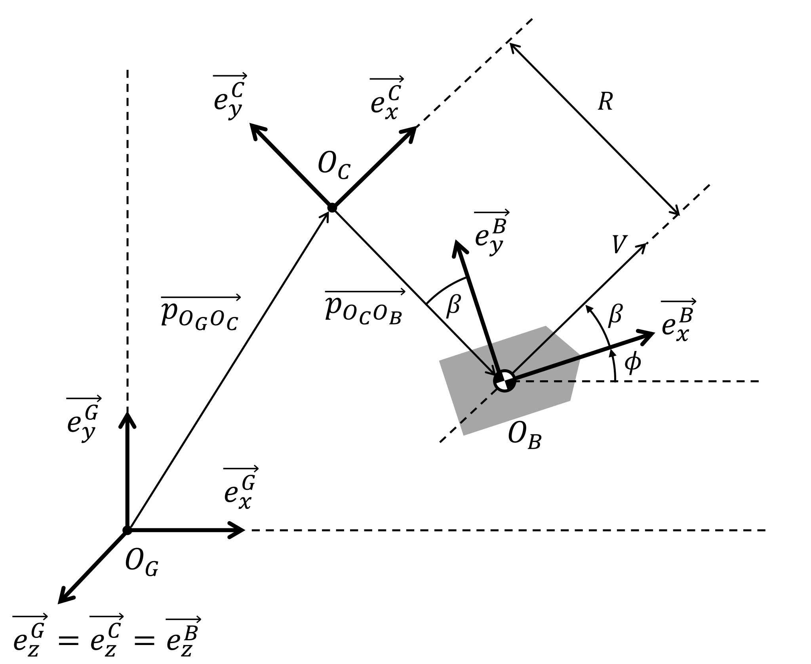

# Path Tracking
Several path-tracking algorithms are implemented with python.

- [Vehicle Models for Simulation](#vehicle-models-for-simulation)
  - [x] [Dynamic Bicycle Model](#dynamic-bicycle-model)
  - [x] [Kinematic Bicycle Model](#kinematic-bicycle-model)
  - [x] [Unicycle Model](#unicycle-model)
- [Control Algorithms](#control-algorithms)
  - [x] [Bang-Bang Control](#bang-bang-control)
  - [x] [PID Control](#pid-control)
  - [x] [Pure Pursuit Control](#pure-pursuit-control)
  - [x] [Stanley Control](#stanley-control)
  - [ ] Fuzzy Logic Control
  - [ ] Dynamic Window Approach
  - [ ] State Lattice Planner
  - [ ] State Feedback Control
  - [ ] Linear Quadratic Regulator
  - [ ] Model Predictive Control
  - [x] [Model Predictive Path-Integral Control](#model-predictive-path-integral-control)
  - [ ] Sliding Mode Control
  - [ ] Q-Learning
  - [ ] Multi Layer Perceptron
  - [ ] Linear Quadratic Gaussian
  - [ ] H∞ Control (LMI)
  - [ ] Lyapunov
  - [ ] Adaptive Control

## Vehicle Models for Simulation

### Definition of Coordinate Systems


### Dynamic Bicycle Model

```math
\begin{align}
&\frac{\mathrm{d}}{\mathrm{d}t}
\begin{bmatrix}
p^G_x \\
p^G_y \\
\phi \\
v^B_x \\
v^B_y \\
\omega \\
\end{bmatrix}
=
\begin{bmatrix}
v^B_x \cos\phi - v^B_y \sin\phi \\
v^B_x \sin\phi + v^B_y \cos\phi \\
\omega \\
{a}\cos\beta - (F_{f}^{\rm{lat}}\sin {{\delta}})/m + v^B_y \omega \\
{a}\sin\beta + F_{r}^{\rm{lat}}/m + F_{f}^{\rm{lat}} \cos{\delta}/m - v^B_x \omega \\
(F_{f}^{\rm{lat}}l_f\cos{\delta} - F_{r}^{\rm{lat}}l_r)/I_z\
\end{bmatrix}, \\ \\
& F_{f}^{\rm{lat}} = - C_f \left( \frac{v^B_y + l_f \omega}{v^B_x} - {\delta} \right), \\ \\
& F_{r}^{\rm{lat}} = - C_r \left( \frac{v^B_y - l_r \omega}{v^B_x} \right), \\ \\
& \beta = \tan^{-1} \left( \frac{v^B_y}{v^B_x} \right) \approx \frac{v^B_y}{v^B_x} \ \ \  (\because v^B_y \ll v^B_x ).
\end{align}
```
<p align="center">

</p>

https://github.com/MizuhoAOKI/path_tracking/assets/63337525/d51c3821-9b35-4e91-8235-e63b18f33f03

```sh
cd path_tracking
poetry run jupyter notebook notebooks/dynamic_bicycle_model.ipynb
```

### Kinematic Bicycle Model

```math
\begin{align}
& \frac{\mathrm{d}}{\mathrm{d}t}
\begin{bmatrix}
p^G_x \\
p^G_y \\
\phi \\
V
\end{bmatrix}
=
\begin{bmatrix}
V \cos(\phi + \beta) \\
V \sin(\phi + \beta) \\
(V/l_r)  \sin\beta \\
{a}
\end{bmatrix},\\ \\
& \beta = \tan^{-1} \left( \frac{l_r}{l_f + l_r} \tan({\delta}) \right).
\end{align}
```

<p align="center">

</p>

https://github.com/MizuhoAOKI/path_tracking/assets/63337525/b85fe31c-3e4a-47a9-bc54-694cde225bd5

```sh
cd path_tracking
poetry run jupyter notebook notebooks/kinematic_bicycle_model.ipynb
```

### Unicycle Model

```math
\begin{align}
\frac{\mathrm{d}}{\mathrm{d}t}
\begin{bmatrix}
p^G_x \\
p^G_y \\
\phi \\
V
\end{bmatrix}
=
\begin{bmatrix}
V \cos\phi \\
V \sin\phi \\
( V / l ) \tan{\delta} \\
{a}
\end{bmatrix}.
\end{align}
```

<p align="center">

</p>

https://github.com/MizuhoAOKI/path_tracking/assets/63337525/8cba0010-6a21-4830-8974-b4b57c166bcf

```sh
cd path_tracking
poetry run jupyter notebook notebooks/unicycle_model.ipynb
```

## Control Algorithms
### Bang-Bang Control

https://github.com/MizuhoAOKI/path_tracking/assets/63337525/cc88214e-3914-4126-ac57-3f63d8397094

```sh
cd path_tracking
poetry run jupyter notebook notebooks/bangbang.ipynb
```

### PID Control

https://github.com/MizuhoAOKI/path_tracking/assets/63337525/83e813d9-b611-49da-abe2-45333bfb80d2

```sh
cd path_tracking
poetry run jupyter notebook notebooks/pid.ipynb
```

### Pure-Pursuit Control

https://github.com/MizuhoAOKI/path_tracking/assets/63337525/a23f8437-d695-4848-83fb-a8424f311683

```sh
cd path_tracking
poetry run jupyter notebook notebooks/purepursuit.ipynb
```

### Stanley Control

https://github.com/MizuhoAOKI/path_tracking/assets/63337525/43f3ce4f-8181-45ad-bc08-ac96f3a91e2b

```sh
cd path_tracking
poetry run jupyter notebook notebooks/stanley.ipynb
```

### Dynamic Window Approach


### State Lattice Planner


### State Feedback Control


### Linear Quadratic Regulator


### Model Predictive Control


### Model Predictive Path-Integral Control

https://github.com/MizuhoAOKI/path_tracking/assets/63337525/7752406f-9e0b-473a-bbaa-8e0fe2aa689a

```sh
cd path_tracking
poetry run jupyter notebook notebooks/mppi.ipynb
```

### Sliding Mode Control


### Q-Learning

